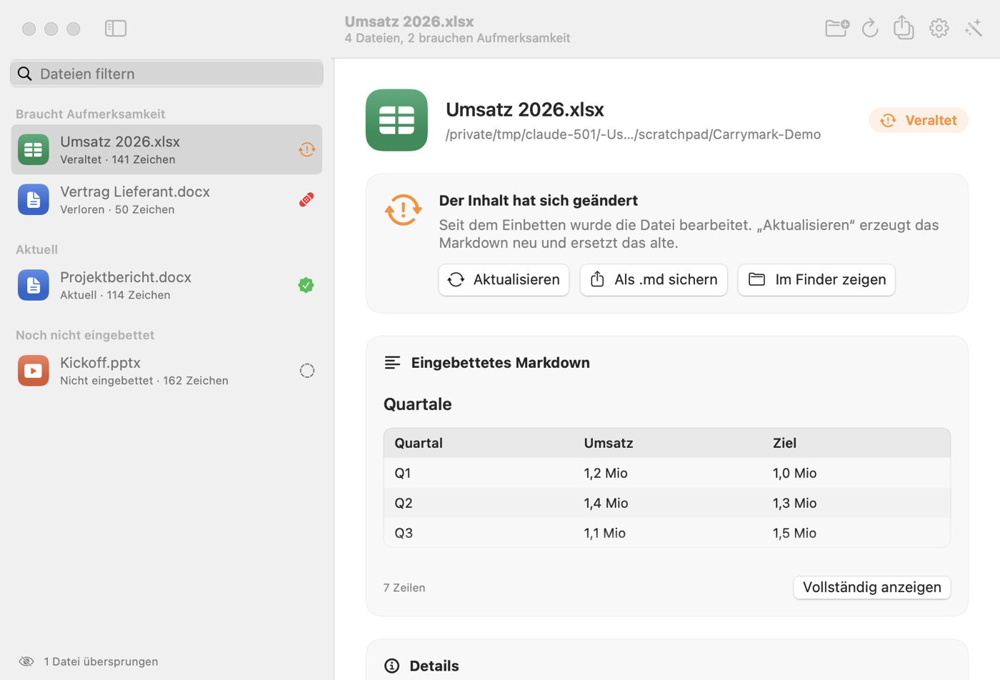
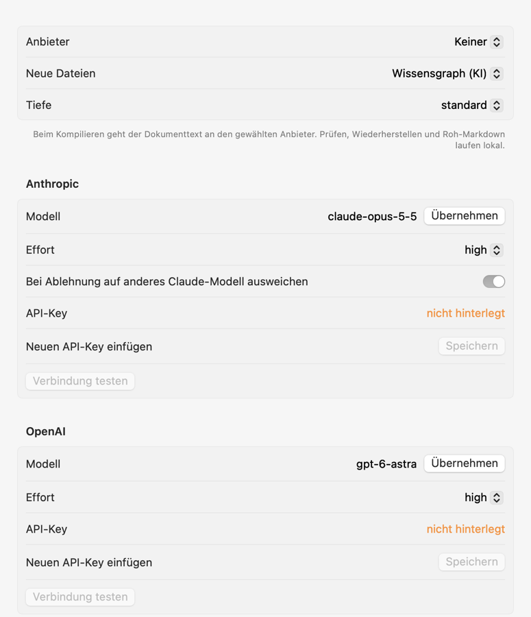

# OfficeMD

Wissen gehört in die Datei, aus der es stammt. OfficeMD bettet einen geprüften Wissensgraphen
oder einen Markdown-Abzug direkt in DOCX, XLSX und PPTX ein und merkt später, ob dieses Wissen
noch zum Dokument passt.

Grundlage ist [Knowledge Distiller](https://github.com/GodModeAI2025/knowledge-distiller): Sein
Format `.knowledge.json` trennt Begriffe, Aussagen und Belege, und jeder Beleg zeigt auf eine
konkrete Stelle im Quelltext. OfficeMD nimmt diesen Graphen, legt ihn als regulären
Custom-XML-Part ins Office-Paket und prüft die Belege bei jedem `check` gegen den aktuellen Text.

Landingpage mit dem Konzept: [`docs/index.html`](docs/index.html)

## Was man davon hat

- Die Datei trägt ihr Wissen selbst. Wer sie per Mail bekommt, bekommt den Graphen mit.
- „Veraltet“ ist keine Ja/Nein-Frage, sondern eine Zahl: *1 von 3 Belegen sind im Dokument nicht
  mehr auffindbar.*
- `officemd sync` prüft und aktualisiert in einem Schritt: Mit deinem Anthropic- oder
  OpenAI-Key wird ein veraltetes Dokument nach den Regeln des Distillers neu kompiliert, geprüft
  und eingebettet. Die alte Fassung wird archiviert, menschliche Ergänzungen mit noch
  auffindbarem Zitat werden übernommen.
- Einen fertigen Graphen spielt `officemd update` als additiven Merge ein. Menschliche
  Ergänzungen und Review-Status bleiben erhalten, jede Änderung wird als Diff festgehalten.
- Geht der Part beim Speichern verloren, erkennt OfficeMD das und stellt ihn aus dem Sidecar
  wieder her.

## Schnellstart

```bash
git clone --recurse-submodules https://github.com/GodModeAI2025/OfficeMD.git
cd OfficeMD
./officemd selftest          # Pakettest ohne Office, ein paar Sekunden
```

Python 3.9 oder neuer, keine Abhängigkeiten außer der Standardbibliothek. Nur die
KI-Kompilierung braucht die SDKs von Anthropic bzw. OpenAI und Python 3.10 oder neuer; das
richtet `./officemd setup-ai` ein. Wer lieber
installiert: `pip install -e .` stellt den Befehl `officemd` bereit. Fehlt das Submodule, hilft
`git submodule update --init`.

```text
$ officemd embed Bericht.docx --graph bericht.knowledge.json
Eingebettet (graph): Bericht.docx
  Fingerprint: omd-text-v1:4eb3839de4ff…
  Part-GUID:   {056801AB-A23E-4A9E-B544-4F9F1DC3728C}
  Sidecar:     Bericht.docx.knowledge
  Belege:      3 von 3 gefunden

$ officemd check Bericht.docx          # nachdem jemand den Text geändert hat
Veraltet      Bericht.docx (graph)
              Text hat sich geändert. 1 von 3 Belegen sind im Dokument nicht mehr
              auffindbar. Betroffene Claims neu bewerten und mit officemd update einspielen.

$ officemd verify Bericht.docx
2 von 3 Belegen gefunden, 1 nicht auffindbar, 0 nicht prüfbar.
  NOT_FOUND     evidence-wartung: excerpt does not occur in the normalized source
```

## Zwei Modi

**Roh-Markdown** braucht keine KI. `officemd embed Datei.docx` extrahiert den Text
deterministisch und bettet ihn als Markdown ein: Absätze bei Word, eine Tabelle pro Blatt bei
Excel, Folien samt Notizen bei PowerPoint. Aktualität wird über den Text-Fingerprint geprüft.

**Wissensgraph** braucht für das Kompilieren ein Sprachmodell. OfficeMD ruft dafür Anthropic
oder OpenAI mit deinem eigenen API-Key auf, siehe [KI-Kompilierung](#ki-kompilierung). Alles
danach läuft offline: Graph normalisieren, validieren, Belege verifizieren, Markdown rendern,
mergen. Wer lieber einen eigenen Agenten nutzt, kann den Graphen auch extern schreiben lassen:

```bash
officemd extract Bericht.docx -o bericht.segments.json   # Eingabe für den Agenten
# ... Agent schreibt bericht.knowledge.json nach SKILL.md des Distillers ...
officemd embed Bericht.docx --graph bericht.knowledge.json
```

## KI-Kompilierung

Ein Befehl prüft und aktualisiert bei Bedarf:

```bash
./officemd setup-ai                          # einmalig: .venv mit Python 3.12 und den SDKs
./officemd config set provider anthropic     # oder openai
./officemd config set-key anthropic          # Key wird abgefragt, landet im Schlüsselbund
./officemd config test anthropic             # kurzer Probeaufruf

./officemd sync ~/Dokumente/Projekt          # alle Office-Dateien prüfen und aktualisieren
./officemd sync Bericht.docx --dry-run       # nur anzeigen, was passieren würde
```

Was `sync` pro Datei macht:

| Zustand | Aktion |
|---|---|
| Aktuell | nichts |
| Nie vorhanden | kompilieren und einbetten (mit `--raw` oder `mode raw`: Roh-Markdown ohne KI) |
| Veraltet, Roh-Markdown | Roh-Markdown neu einbetten, ohne KI |
| Veraltet, Wissensgraph | aktuellen Text neu kompilieren, alte Fassung nach `versions/` archivieren, menschliche Ergänzungen übernehmen, deren Zitat noch im Text steht |
| Verloren | aus dem Sidecar wiederherstellen; ist der Text inzwischen geändert, danach neu kompilieren |
| Nicht lesbar oder in Office geöffnet | überspringen |

**Wie kompiliert wird.** Der Prompt besteht aus den Regeln von `SKILL.md` (Abschnitte „Nicht
tun“ und Phase 2) und dem Compilerprofil `profiles/default.json` des eingebundenen Distillers.
Er wird zur Laufzeit aus dem Submodule gelesen, ändert sich der Distiller, ändert sich der
Prompt mit. Das Modell antwortet in einem kompakten, per JSON-Schema erzwungenen Format: Belege
mit wörtlichen Zitaten, Cluster, Begriffe, Aussagen, Beziehungen. Den Spec-1.1-Graphen baut
OfficeMD daraus selbst, samt Quelle, Selektoren, Herkunft und Review-Status. Zähler und Scores
berechnet `build_graph.py`. Danach laufen `validate_knowledge.py` und `verify_evidence.py`.
Findet sich ein Zitat nicht wörtlich im Dokument oder ist der Graph nicht konform, gehen die
Fehler mit der vorherigen Ausgabe zurück ans Modell. Nach zwei erfolglosen Korrekturrunden
bricht OfficeMD ab und bettet nichts ein, wie es `SKILL.md` verlangt.

**Fakten und Chunks.** Konkrete Werte wie Beträge, Termine, Zählungen oder Grenzwerte liefert das
Modell als Fakten, jeweils mit Beleg, der den Wert wörtlich enthält. Widersprüchliche Werte
bleiben beide erhalten. Die Retrieval-Chunks schreibt nicht das Modell, sondern OfficeMD: je
Begriff ein `source_claims`-Chunk aus Definition und belegten Aussagen, bereinigt nach SPEC §4.9,
höchstens 4.000 Zeichen, mit Verweis auf die Belege. Begriffe ohne Beleg bekommen keinen Chunk.

**Große Dokumente.** Über `section_chars` (Standard 120.000 Zeichen) wird das Dokument an
Segmentgrenzen in Abschnitte geteilt. Jeder Abschnitt wird für sich kompiliert und geprüft,
mit eigenen Korrekturrunden. Spätere Abschnitte bekommen die Liste der bereits angelegten
Begriffe und verwenden deren IDs weiter. Zum Schluss führt OfficeMD alles zu einem Graphen
zusammen und prüft ihn als Ganzes. Gekürzt wird nie. `max_input_chars` (Standard 2 Millionen
Zeichen) ist nur eine Kostenbremse; darüber meldet OfficeMD das, statt anzufangen.

**Anbieter und Voreinstellungen.**

| Anbieter | Modell (Standard) | Aufruf |
|---|---|---|
| Anthropic | `claude-opus-5-5`, Effort `high` | offizielles `anthropic`-SDK, Messages API mit Streaming und `output_config.format` (JSON-Schema). Systemprompt mit Prompt-Caching. Serverseitiger Fallback bei Ablehnung ist eingeschaltet (`fallbacks: "default"`), abschaltbar mit `config set anthropic.fallbacks false`. |
| OpenAI | `gpt-6-astra`, Effort `high` | offizielles `openai`-SDK, Responses API mit `text.format` (JSON-Schema, strict) |

Modelle und Effort lassen sich ändern, etwa `config set anthropic.model claude-sonnet-5-5`.
`config show` zeigt alles, auch woher der Key kommt, aber nie den Key selbst.

**API-Keys.** Reihenfolge: Umgebungsvariable (`OFFICEMD_ANTHROPIC_API_KEY`,
`ANTHROPIC_API_KEY`, `OFFICEMD_OPENAI_API_KEY`, `OPENAI_API_KEY`), dann der macOS-Schlüsselbund
(Dienst `officemd`), auf anderen Systemen eine Datei `credentials.json` mit Rechten 0600. Ein Key
steht nie in Argumenten oder Ausgaben; die App und `config set-key` übergeben ihn über stdin.

**Datenschutz.** Beim Kompilieren geht der extrahierte Dokumenttext an den gewählten Anbieter,
`sync` sagt vor jedem Aufruf, an wen. Prüfen, Wiederherstellen und Roh-Markdown laufen lokal.

**Stand der Tests.** Kompilieren, Korrekturschleife, alle `sync`-Pfade, Konfiguration und
Keyablage sind mit einem Fake-Anbieter getestet, ohne Netz. Gegen die echten APIs lief nur ein
Aufruf mit absichtlich falschem Key: Beide SDKs nehmen die Anfrage an und melden den Key sauber
als ungültig. Ein Lauf mit gültigem Key steht noch aus.

## Befehle

| Befehl | Zweck |
|---|---|
| `check DATEI\|ORDNER [--json]` | Zustand anzeigen. Ordner werden rekursiv durchsucht. |
| `extract DATEI [--markdown]` | Normalisierte Segmente (JSON) oder Roh-Markdown ausgeben |
| `embed DATEI [--graph G]` | Roh-Markdown oder Graph einbetten. Bricht ab, wenn Belege fehlen. |
| `verify DATEI` | Belege gegen den aktuellen Text prüfen |
| `update DATEI NEU.knowledge.json` | Additiv mergen, alte Fassung archivieren, neu einbetten |
| `render DATEI` | Markdown aus dem eingebetteten Wissen |
| `restore DATEI` | Verlorenen Part aus dem Sidecar zurückschreiben |
| `strip DATEI [--keep-props]` | Part entfernen; mit `--keep-props` lässt sich „Verloren“ simulieren |
| `selftest [--office]` | Pakettest, mit `--office` echter Roundtrip in Word, Excel und PowerPoint |
| `sync PFAD… [--raw] [--dry-run]` | Prüfen und bei Bedarf per KI neu kompilieren und einbetten |
| `compile DATEI [-o G]` | Nur kompilieren, Graph als Datei schreiben |
| `config show\|set\|set-key\|delete-key\|test` | Anbieter, Modelle, Effort, Keys |
| `setup-ai` | `.venv` mit Python 3.12 und den SDKs anlegen |

Exit-Codes von `check`: 0 alles aktuell oder nie eingebettet, 1 mindestens eine Datei veraltet,
3 verloren oder nicht lesbar, 2 Bedienfehler. `sync` endet mit 2, wenn eine Datei nicht
aktualisiert werden konnte.

## Zustände

| Zustand | Bedeutung |
|---|---|
| Nie vorhanden | Kein Part, kein Fingerprint-Eintrag |
| Aktuell | Text-Fingerprint stimmt mit dem beim Einbetten überein |
| Veraltet | Text geändert; im Graph-Modus mit Zählung der nicht mehr auffindbaren Belege |
| Verloren | Fingerprint-Eintrag in `docProps/custom.xml` vorhanden, Part fehlt |
| Nicht lesbar | Verschlüsselt, Makros (`.docm`, `vbaProject.bin`), defektes Archiv, DTD im XML |

Zusätzlich meldet `check`, wenn Office die Datei gerade offen hat (`~$…`). Geschrieben wird dann
nicht.

## Wie der Part im Paket liegt

So, wie Office selbst Custom-XML-Datastores anlegt:

```text
customXml/item1.xml              <omd:knowledge> mit Graph (CDATA) und gerendertem Markdown
customXml/itemProps1.xml         ds:datastoreItem mit eigener GUID und Schema-Referenz
customXml/_rels/item1.xml.rels   Item -> ItemProps
word/_rels/document.xml.rels     Relationship vom Typ customXml auf das Item
[Content_Types].xml              Override für itemProps
docProps/custom.xml              OfficeMDFingerprint, -Version, -PartGuid, -Mode, -EmbeddedAt
```

Bei Excel und PowerPoint hängt die Relationship an `xl/workbook.xml` bzw.
`ppt/presentation.xml`. Dokumentinhalt wie `word/document.xml` fasst OfficeMD nie an, die Bytes
bleiben identisch. Geschrieben wird atomar über eine temporäre Datei im selben Ordner; hat sich
die Datei seit dem Lesen geändert, bricht OfficeMD ab.

Neben der Datei liegt der Sidecar-Ordner `Datei.docx.knowledge/` mit `knowledge.json`,
`knowledge.md`, `embed.json`, dem Versionsarchiv `versions/` und den Merge-Diffs.

## Was getestet ist und was nicht

Getestet mit echtem Office (macOS 27.2, `officemd selftest --office`, Bericht in
[`compat/`](compat/office-roundtrip-20261006.md)): Word 16.113.4, Excel 16.113.3 und
PowerPoint 16.113.3 behalten Part, Registrierung, GUID und Fingerprint-Eintrag, nachdem die
Datei in der App geöffnet, geändert und gespeichert wurde. Die Belegprüfung funktioniert danach
weiter.

Nicht getestet: Office für Windows, Office im Browser, der Dokumentinspektor, Pages, Google Docs,
LibreOffice und Konverter. Die Liste der „möglichen Ursachen“, die `check` beim Zustand
„Verloren“ ausgibt, ist eine Annahme und noch nicht belegt. Wer einen dieser Wege prüft, gern
einen Bericht in `compat/` ergänzen.

Die Testsuite (`python3 -m pytest`) läuft ohne Office und deckt Paketstruktur, alle Zustände,
Merge, Adapter und CLI ab.

## Drei Stellen, an denen OfficeMD den Distiller ergänzt

**Fingerprint.** `content_sha256` des Distillers beschreibt die rohen Dateibytes, und die
ändern sich bei jedem Speichern in Office und durch den eingebetteten Part. Seit Adapter 1.1
liefert der Distiller deshalb zusätzlich `normalized_sha256`, einen Hash über Reihenfolge,
Selektoren und Text der Segmente. Diese Erweiterung kam aus OfficeMD
([knowledge-distiller#13](https://github.com/GodModeAI2025/knowledge-distiller/pull/13)).
OfficeMD nutzt ihn als Fingerprint (`omd-text-v1:<normalized_sha256>`) und schreibt ihn in die
Graph-Quelle. Für die Belegprüfung bindet OfficeMD die Quelle, die für die Datei steht, per
`verify_evidence.py --bind` an die aktuelle Extraktion. So zählt die Prüfung auch nach
Textänderungen, welche Belege noch auffindbar sind, und das Ergebnis nennt die Zuordnung
(`matched_by: binding`).

**Merge.** Ein neu kompilierter Graph trägt für dieselbe Quelle einen neuen Byte-Hash, und
`merge_knowledge.py` lehnt das als Widerspruch ab. `officemd update` setzt den Hash der
eingehenden Quelle deshalb auf den der Basis und meldet das im Ergebnis
(`aligned_source_digest`).

**XLSX und PPTX.** Der Distiller liest nur DOCX. OfficeMD bringt eigene Adapter mit, die die
Hilfsfunktionen des Distillers nutzen (pfadsichere Eingabe, ZIP-Grenzen, DTD-Sperre) und dasselbe
Segmentformat liefern. Excel-Zeilen bekommen einen `CsvSelector`, PowerPoint-Absätze einen
`FragmentSelector` wie bei Word plus `PageSelector` mit der Foliennummer. Eine Erweiterung der
Spec war dafür nicht nötig. Formeln werden nie ausgewertet, übernommen wird der gespeicherte Wert.

## Aufbau

```text
officemd                    Startskript ohne Installation
src/officemd/
  cli.py                    Kommandozeile
  ops.py                    check, embed, update, restore, render, strip
  ooxml.py                  Part, Registrierung, custom.xml, atomares Schreiben
  evidence.py               Belegprüfung über verify_evidence.py
  fingerprint.py            Text-Fingerprint
  rawmd.py                  Roh-Markdown
  distiller.py              Subprozess-Aufrufe der Distiller-Skripte
  compiler.py               KI-Kompilierung: Schema, Prompt aus SKILL.md, Assembler, Korrekturschleife
  providers.py              Anthropic und OpenAI über die offiziellen SDKs
  sync.py                   Prüfen und bei Bedarf aktualisieren
  config.py                 Konfiguration und API-Keys
  adapters/ooxml_extract.py XLSX- und PPTX-Extraktion
  selftest.py               Pakettest und Office-Roundtrip per AppleScript
  fixtures.py               Minimale Office-Dateien für Tests
vendor/knowledge-distiller  Submodule, unverändert
tests/                      pytest
compat/                     Kompatibilitätsberichte
docs/index.html             Landingpage
app/                        SwiftUI-Oberfläche (macOS)
```

## Mac-App

Unter `app/` liegt eine schlanke SwiftUI-Oberfläche. Sie ruft nur `officemd check --json` und
die anderen Befehle auf und enthält selbst keine Paketlogik.

```bash
cd app && swift run
```



**Prüfen & aktualisieren** (pro Datei und in der Symbolleiste für alle) ruft `officemd sync`
auf. In den Einstellungen (⌘,) stehen Anbieter, Modus für neue Dateien, Tiefe, Modell und Effort
je Anbieter sowie das Feld für den API-Key. „Speichern“ legt ihn im Schlüsselbund ab,
„Verbindung testen“ schickt einen kurzen Probeaufruf.



Ordner oder Dateien ins Fenster ziehen oder beim Start übergeben
(`swift run OfficeMDApp ~/Dokumente`), dann zeigt die Liste den Zustand jeder Datei. Je nach
Zustand gibt es Roh-Markdown einbetten, Wiederherstellen und Markdown anzeigen. Den Pfad zu
`officemd` findet die App selbst, solange sie aus dem Repository gestartet wird, sonst in den
Einstellungen setzen.

Für Tests fotografiert die App ihr eigenes Fenster, ohne Berechtigung zur Bildschirmaufnahme:
`swift run OfficeMDApp ORDNER --select datei.docx --snapshot bild.png`, mit `--settings` das
Einstellungsfenster. So ist das Bild oben
entstanden. Die Darstellung aller Zustände ist damit geprüft; die Aktionen rufen nur die
getesteten CLI-Befehle auf. Ein signiertes App-Bundle mit eingebettetem Python gibt es noch
nicht.

## Lizenz

MIT
